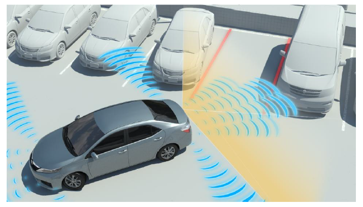
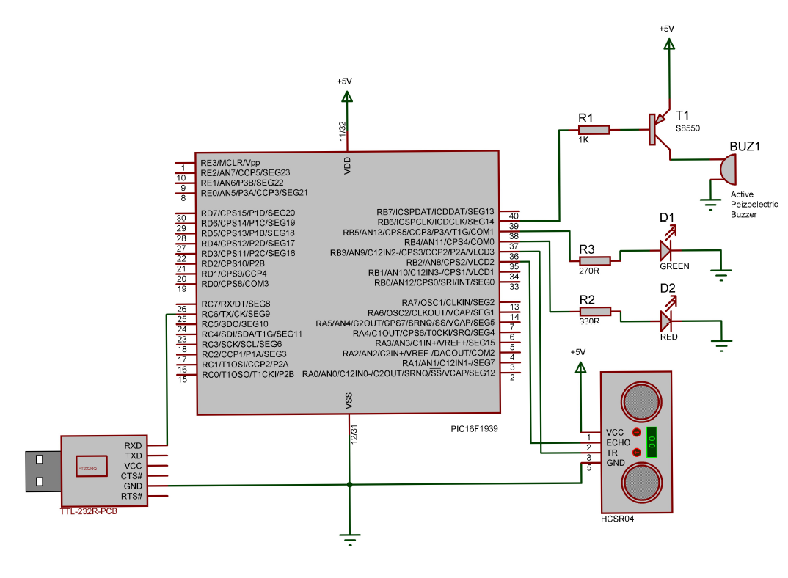

#### Faculty of Electrical Engineering, Sarajevo
#### Lab Work in Automatics and Informatics 2019/2020

---

  

This repository represents an **alarm system for parking assistance in 2D space**. It was developed using MPLAB and a custom printed circuit board with a PIC16F1939 microcontroller. Distance measuring is attained by HC-SR04 module while the adequate signalization is provided by Arduino YL-44 active buzzer module and two LED. Realtime calculated distance, if needed, is displayed on a JavaFX app which listens for data on a serial data port (jSerialComm library)

Demo: https://drive.google.com/open?id=1bvSCSw0Vef0hhNGnWLTlSFUGYI1Yiunn

---

  

